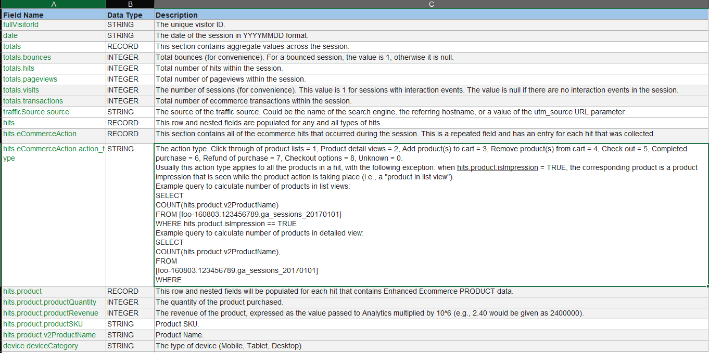
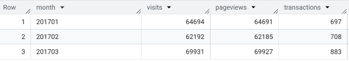
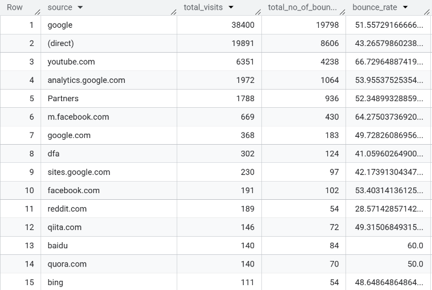
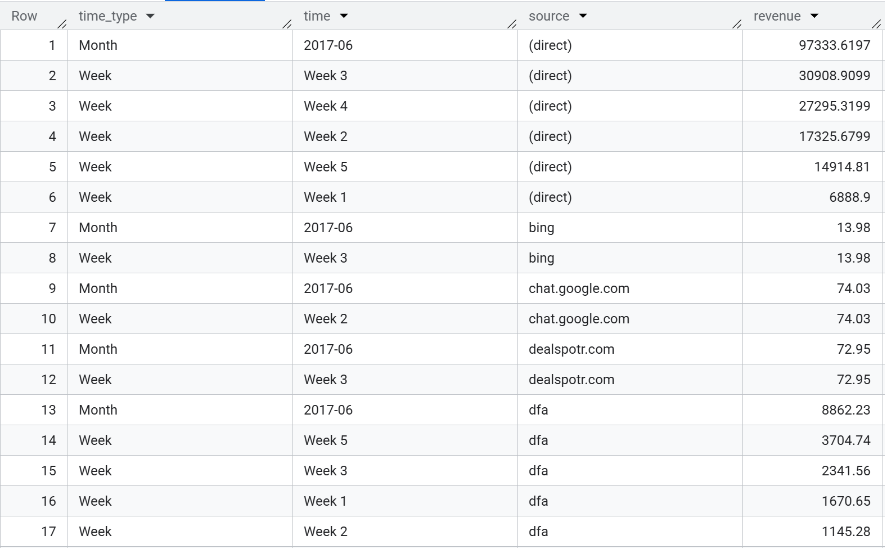
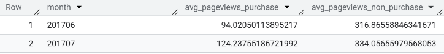
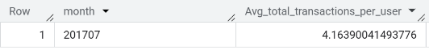
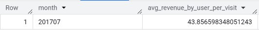
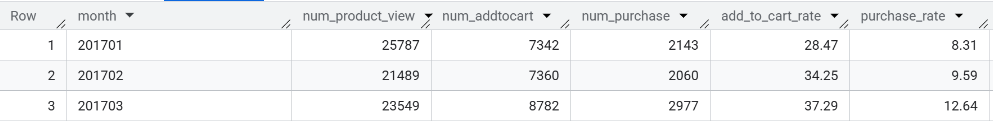

# SQL-E-Commerce
Using SQL to extract and analyze key e-commerce and user behavior metrics from Google Analytics sample data. It covers traffic performance, conversion funnels, revenue breakdowns, and cohort analysis across various timeframes and dimensions. The queries are designed to support data-driven insights into user engagement and purchasing behavior.

## Dataset
Link to the dataset: [https://support.google.com/analytics/answer/3437719?hl=en]

## Description table


## Problem Solving

### Query 01: calculate total visit, pageview, transaction for Jan, Feb, and March 2017 (order by month)
```
SELECT 
      FORMAT_DATE('%Y%m', PARSE_DATE('%Y%m%d', date)) AS month,
      COUNT(totals.visits) as visits,
      COUNT(totals.pageviews) as pageviews,
      COUNT(totals.transactions) as transactions    
FROM `bigquery-public-data.google_analytics_sample.ga_sessions_2017*`
WHERE _table_suffix between '0101' and '0331'
GROUP BY month
ORDER BY month;
```


Insights:
- January 2017 saw 64,694 visits, 64,691 pageviews, and 697 transactions, indicating a solid start to the year with consistent engagement and conversion.
- February 2017 recorded a slight dip with 62,192 visits, 62,185 pageviews, but a modest rise in transactions to 708, suggesting improved purchase efficiency.
- March 2017 showed strong growth across all metrics, reaching 69,931 visits, 69,927 pageviews, and 883 transactions, marking it as the highest-performing month in Q1.

### Query 02: Bounce rate per traffic source in July 2017 (Bounce_rate = num_bounce/total_visit) (order by total_visit DESC)
```
SELECT
    trafficSource.source as source,
    sum(totals.visits) as total_visits,
    sum(totals.Bounces) as total_no_of_bounces,
    (sum(totals.Bounces)/sum(totals.visits))* 100.00 as bounce_rate
FROM `bigquery-public-data.google_analytics_sample.ga_sessions_201707*`
GROUP BY source
ORDER BY total_visits DESC;
```


Insights:
- Google was the top traffic source by volume, with over 38,000 visits and a moderate bounce rate of 51.57%, indicating average session quality.
- YouTube.com, despite being the third-largest source, had a high bounce rate of 66.72%, suggesting users may not have found what they expected or left quickly.
- Direct traffic performed better with a lower bounce rate of 43.27%, implying stronger intent or familiarity with the site.
- m.facebook.com and bing had the highest bounce rates (64.27% and 63.64%, respectively), pointing to weaker engagement or mismatched targeting.
- Smaller sources like dfa, sites.google.com, and google.com showed relatively low bounce rates, possibly reflecting more qualified or niche traffic.

### Query 3: Revenue by traffic source by week, by month in June 2017
```
WITH month_revenue AS
      (SELECT
        'Month' AS time_type,
        FORMAT_DATE('%Y-%m', PARSE_DATE('%Y%m%d', date)) AS time,
        trafficSource.source AS source,
        round(SUM(product.productRevenue) / 1000000,4) AS revenue
      FROM
        `bigquery-public-data.google_analytics_sample.ga_sessions_201706*`,
        UNNEST(hits) AS hits,
        UNNEST(hits.product) AS product
      WHERE
        product.productRevenue IS NOT NULL
      GROUP BY
        source,
        time 
      ORDER BY source
      ),

  weekly_revenue AS (
    SELECT
      'Week' AS time_type,
      CASE EXTRACT(ISOWEEK FROM PARSE_DATE('%Y%m%d', date))
        WHEN 22 THEN "Week 1" --Date from 1st to 4th--
        WHEN 23 THEN "Week 2" --Date from 5th to 11th--
        WHEN 24 THEN "Week 3" --Date from 12th to 18th--
        WHEN 25 THEN "Week 4" --Date from 19th to 25th--
        WHEN 26 THEN "Week 5" --The rest--
        ELSE NULL
      END AS week_number,
      trafficSource.source AS source,
      ROUND(SUM(product.productRevenue) / 1000000, 4) AS revenue
    FROM
      `bigquery-public-data.google_analytics_sample.ga_sessions_201706*`,
      UNNEST(hits) AS hits,
      UNNEST(hits.product) AS product
    WHERE
      product.productRevenue IS NOT NULL
    GROUP BY
      week_number, source, time_type
    ORDER BY source
  )


  SELECT *
FROM (
  SELECT * FROM month_revenue
  UNION ALL
  SELECT * FROM weekly_revenue
)
ORDER BY
  source,
  revenue DESC,
  time_type;

```



Logical Explanation:
June 2017 doesn’t start on a Monday, so using ISO week numbers (22–26) allows for consistent weekly grouping:
- Week 1 (June 1–4): Captures the partial start of the month
- Week 2 (June 5–11)
- Week 3 (June 12–18)
- Week 4 (June 19–25)
- Week 5 (June 26–30): Captures the final partial week
This segmentation ensures:
- Logical grouping of user behavior and revenue trends
- Avoids splitting weeks across months, which can distort performance analysis
- Aligns with business reporting cycles, especially for marketing and campaign tracking

Insights:
- (direct) traffic was the dominant revenue source, contributing over $97K, with a strong upward trend from Week 1 to Week 4. This suggests an increase in user intent or successful campaign momentum.
- dfa showed volatile performance, with revenue peaking in Week 5 ($3.7K) and Week 3 ($2.3K), but dropping to zero in Week 4, indicating inconsistent engagement or campaign pacing.
- chat.google.com and bing contributed minor revenue, likely from niche referrals or isolated user actions.

### Query 04: Average number of pageviews by purchaser type (purchasers vs non-purchasers) in June, July 2017.
```
WITH purchased_pageviews AS (
  SELECT 
    FORMAT_DATE('%Y%m', PARSE_DATE('%Y%m%d', date)) AS month,
    SUM(totals.pageviews) / COUNT(DISTINCT fullVisitorId) AS avg_pageviews_purchase
  FROM `bigquery-public-data.google_analytics_sample.ga_sessions_2017*`,
    UNNEST(hits) AS hits,
    UNNEST(hits.product) AS product
  WHERE 
    totals.transactions >= 1
    AND product.productRevenue IS NOT NULL
    AND EXTRACT(MONTH FROM PARSE_DATE('%Y%m%d', date)) IN (6, 7)
    AND EXTRACT(YEAR FROM PARSE_DATE('%Y%m%d', date)) = 2017
  GROUP BY month
),
nonpurchased_pageviews AS (
  SELECT 
    FORMAT_DATE('%Y%m', PARSE_DATE('%Y%m%d', date)) AS month,
    SUM(totals.pageviews) / COUNT(DISTINCT fullVisitorId) AS avg_pageviews_non_purchase
  FROM `bigquery-public-data.google_analytics_sample.ga_sessions_2017*`,
    UNNEST(hits) AS hits,
    UNNEST(hits.product) AS product
  WHERE 
    totals.transactions IS NULL
    AND product.productRevenue IS NULL
    AND EXTRACT(MONTH FROM PARSE_DATE('%Y%m%d', date)) IN (6, 7)
    AND EXTRACT(YEAR FROM PARSE_DATE('%Y%m%d', date)) = 2017
  GROUP BY month
)
SELECT 
  p.month AS month,
  p.avg_pageviews_purchase,
  n.avg_pageviews_non_purchase
FROM purchased_pageviews AS p
FULL JOIN nonpurchased_pageviews AS n
  ON p.month = n.month
ORDER BY p.month;
```


Insights:
- Non-purchasers consistently viewed more pages than purchasers in both months — over 3x more on average. This could indicate browsing behavior without strong purchase intent, or friction in the conversion funnel.
- Purchasers showed increased engagement in July, with average pageviews rising from 94 to 124, suggesting deeper product exploration or more complex decision-making.
- The gap between purchasers and non-purchasers widened slightly in July, reinforcing the need to understand what prevents high-engagement users from converting.

### Query 05: Average number of transactions per user that purchased in July 2017
```
SELECT
  FORMAT_DATE('%Y%m', PARSE_DATE('%Y%m%d', date)) AS month,
  SUM(totals.transactions) / COUNT(DISTINCT fullVisitorId) AS Avg_total_transactions_per_user
FROM `bigquery-public-data.google_analytics_sample.ga_sessions_201707*`,
  UNNEST(hits) AS hits,
  UNNEST(hits.product) AS product
WHERE
    totals.transactions >=1
    and productRevenue is not null
GROUP BY month;
```


Insights: 
-In July 2017, the average total transaction by user was 4.14

### Query 06: Average amount of money spent per session. Only include purchaser data in July 2017
```
SELECT
  FORMAT_DATE('%Y%m', PARSE_DATE('%Y%m%d', date)) AS month,
  (SUM(product.productRevenue) / SUM(totals.visits))/1000000 AS avg_revenue_by_user_per_visit
FROM `bigquery-public-data.google_analytics_sample.ga_sessions_201707*`,
  UNNEST(hits) AS hits,
  UNNEST(hits.product) AS product
WHERE
  totals.transactions >= 1
  AND product.productRevenue IS NOT NULL
GROUP BY month;
```


Insights:
In July 2017, the average revenue by user per visit was $43.85

### Query 07: Other products purchased by customers who purchased product "YouTube Men's Vintage Henley" in July 2017. Output should show the product name and the quantity ordered.
```
WITH henley_sessions AS (
  SELECT DISTINCT
    fullVisitorId,
    visitId
  FROM `bigquery-public-data.google_analytics_sample.ga_sessions_201707*`,
    UNNEST(hits) AS hits,
    UNNEST(hits.product) AS product
  WHERE product.v2ProductName = "YouTube Men's Vintage Henley"
    AND product.productRevenue IS NOT NULL
    AND totals.transactions >= 1
)
SELECT
  other_products.v2ProductName AS other_purchased_product,
  SUM(other_products.productQuantity) AS quantity
FROM henley_sessions as hs
JOIN `bigquery-public-data.google_analytics_sample.ga_sessions_201707*`as s
  ON hs.fullVisitorId = s.fullVisitorId AND hs.visitId = s.visitId,
  UNNEST(s.hits) AS hits,
  UNNEST(hits.product) AS other_products
WHERE other_products.v2ProductName != "YouTube Men's Vintage Henley"
  AND other_products.productRevenue IS NOT NULL
  AND s.totals.transactions >= 1
GROUP BY other_purchased_product
ORDER BY quantity DESC;

```


Insights:
- Customers who purchased the YouTube Men's Vintage Henley tended to buy a diverse mix of branded lifestyle products, including apparel, accessories, and novelty items.
- The top co-purchased item was Google Sunglasses (20 units), suggesting strong interest in stylish, recognizable merchandise.
- Apparel items like Google Women's Vintage Hero T-Shirt, Men’s Short Sleeve Tees, and Fleece Hoodies were frequently bought together, indicating a preference for bundled fashion or brand-themed outfits.
- Smaller accessories (e.g., Lip Balm, Mugs, Caps, Decals) were consistently purchased in pairs, hinting at impulse buys or gift-oriented behavior.
- The presence of Android-branded items and the YouTube Bottle Infuser shows cross-brand affinity within the Google ecosystem

### "Query 08: Calculate cohort map from product view to addtocart to purchase in Jan, Feb, and March 2017. For example, 100% product view, then 40% add_to_cart, and 10% purchase.
Add_to_cart_rate = number of products added to cart/number of product views. Purchase_rate = number of product purchases/number of  product views. The output should be calculated at the product level."
```
WITH product_view AS(
  SELECT
    format_date("%Y%m", parse_date("%Y%m%d", date)) as month,
    count(product.productSKU) as num_product_view
  FROM `bigquery-public-data.google_analytics_sample.ga_sessions_*`
  , UNNEST(hits) AS hits
  , UNNEST(hits.product) as product
  WHERE _TABLE_SUFFIX BETWEEN '20170101' AND '20170331'
  AND hits.eCommerceAction.action_type = '2'
  GROUP BY 1
),

add_to_cart AS(
  SELECT
    format_date("%Y%m", parse_date("%Y%m%d", date)) AS month,
    count(product.productSKU) as num_addtocart
  FROM `bigquery-public-data.google_analytics_sample.ga_sessions_*`
  , UNNEST(hits) AS hits
  , UNNEST(hits.product) AS product
  WHERE _TABLE_SUFFIX BETWEEN '20170101' AND '20170331'
  AND hits.eCommerceAction.action_type = '3'
  GROUP BY 1
),

purchase AS(
  SELECT
    format_date("%Y%m", parse_date("%Y%m%d", date)) AS month,
    count(product.productSKU) as num_purchase
  FROM `bigquery-public-data.google_analytics_sample.ga_sessions_*`
  , UNNEST(hits) AS hits
  , UNNEST(hits.product) as product
  WHERE _TABLE_SUFFIX BETWEEN '20170101' AND '20170331'
  AND hits.eCommerceAction.action_type = '6'
  AND product.productRevenue IS NOT NULL 
  GROUP BY 1
)

SELECT
    pv.*,
    num_addtocart,
    num_purchase,
    ROUND(num_addtocart*100/num_product_view,2) AS add_to_cart_rate,
    ROUND(num_purchase*100/num_product_view,2) AS purchase_rate
FROM product_view pv
LEFT JOIN add_to_cart a ON pv.month = a.month
LEFT JOIN purchase p ON pv.month = p.month
ORDER BY pv.month;
```


Insights:
- Conversion efficiency improved month-over-month: Add-to-cart and purchase rates rose steadily from January to March.
- March 2017 had the strongest funnel performance, with over 37% of product viewers adding items to cart and 12.64% completing purchases, indicating better product-market fit or optimized UX.
- The gap between add-to-cart and purchase narrowed in March, suggesting fewer drop-offs during checkout

## What I Learned from This Project
This was the first project I uploaded to GitHub, and it taught me valuable foundational skills in using the platform effectively — from version control to documentation and sharing work publicly.
Through this project, I also had the opportunity to:
- Practice SQL in a real-world context, writing queries to extract, analyze, and interpret data.
- Solve a business problem using data-driven insights, which helped me connect technical skills with strategic thinking.
- Strengthen my ability to structure analysis, communicate findings clearly, and think critically about user behavior and performance metrics.
Overall, this project marked a key milestone in my journey toward becoming a data analyst, combining technical execution with business impact.


